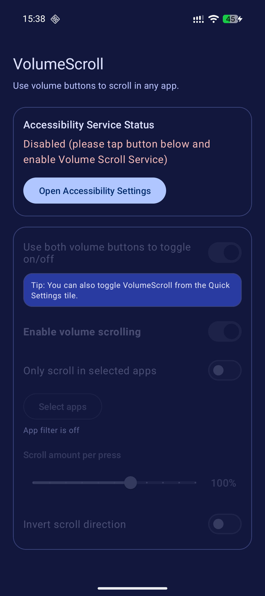
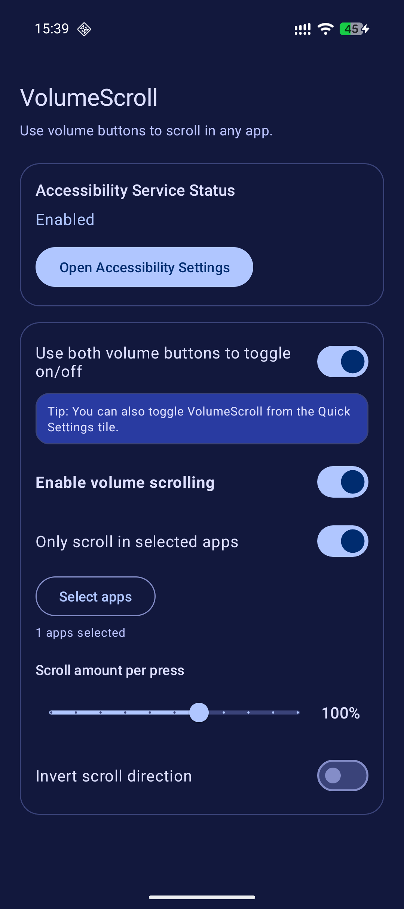

# VolumeScroll

**A small Android app that lets you scroll almost anywhere using your volume buttons.**

## Why?

I built this because it's more comfortable for me to read through long articles or essays page-by-page. It's more like reading a book 😃 Plus, scrolling like this is way more comfortable when you only hold your phone in one hand, e.g. in public transport.

## Features

- aesthetic minimalist Material You UI
- ability to select apps in which volume-scrolling will be enabled
- customizable scroll amount
- invert direction option
- dual-volume-button shortcut toggle
- Quick Settings tile

## Screenshots

<p align="center">
  <a href="screenshots/disabled-blue.png">
    
  </a>
  <a href="screenshots/enabled-blue.png">
    
  </a>
</p>

## Why Accessibility?

Android does not provide a normal app API for global scrolling in other apps.
Using an Accessibility Service is the only way to do this.

The app doesn't do anything else with the Accesibility permission. The app doesn't need network permission and you can inspect the code yourself.

## Setup (User)

1. Install and open the app.
2. Tap Open Accessibility Settings.
3. Enable Volume Scroll Service.
4. Return to the app and configure your preferences.

Optional:

- Add the VolumeScroll Quick Settings tile from the system tile editor.

## Build (Developer)

### Requirements

- Android Studio (latest stable recommended)
- Android SDK 36
- JDK 11+

### Build debug APK

```bash
./gradlew :app:assembleDebug
```

## Project Notes

- Main app UI: `app/src/main/java/com/yeapguy/volumescroll/MainActivity.java`
- Accessibility service: `app/src/main/java/com/yeapguy/volumescroll/VolumeScrollAccessibilityService.java`
- Quick Settings tile: `app/src/main/java/com/yeapguy/volumescroll/VolumeScrollTileService.java`

## Contributing

Issues and PRs are welcome.
If you report a bug, please include:

- Android version
- device model
- exact repro steps


## License

[MIT](https://choosealicense.com/licenses/mit/)